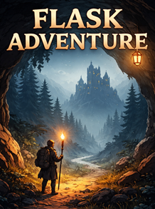

# Flask Adventure

A browser-based text adventure game engine built with Flask. Started as a simple experiment and evolved into a structured, session-driven adventure engine — built from the ground up, not copied from tutorials.

---

## Project Goals

- Learn Flask deeply through real building
- Create a modular, extensible text-adventure engine
- Manage game state cleanly on the server
- Build a foundation that can evolve into a reusable engine template

---

## What Has Been Built

### Core Engine Architecture

The game is split into focused modules:

| File | Purpose |
|------|---------|
| `controller.py` | Orchestrates all game systems |
| `parser.py` | Parses raw text commands into structured input |
| `actions.py` | Executes player actions (move, pick up, drop, use, look) |
| `events.py` | Handles game events and triggers |
| `persistence.py` | Save and load game state to/from database |
| `gameObjects.py` | Map, Room, and Item classes |
| `player.py` | Player state and movement logic |

### Game Objects

- `Item` — name, description, use response
- `Room` — name, description, exits, inventory, exit destinations
- `Map` — floors, rooms, events, loaded from `game_data.json`

Rooms support standard grid-based movement and special exit destinations for cross-floor or event-triggered teleport connections.

### Command System

Commands are parsed from plain English input:

```
go south / south
get knife / pickup knife
drop knife
look knife
use axe with door
help
```

The parser converts input into a structured command dict which the action handler executes. Supports direction synonyms, multiple pickup words, and `use [item] with [target]` syntax.

### Event System

Events are defined in `game_data.json` and fire based on game conditions:

- `all_rooms_visited` — triggers when required rooms have been visited
- `item_used_with` — triggers when a specific item is used on a specific target in a specific room

Events can unlock exits, add items to rooms, and display messages to the player.

### Save / Load System

Full game state is persisted to SQLite via Flask-SQLAlchemy:

- Player position and floor
- Player inventory
- Room inventories and states
- Visited rooms and completed events
- Unlocked exits and exit destinations

Each player ID gets its own controller instance, so multiple players can run simultaneously.

### Map System

The map is defined entirely in `game_data.json` — no hardcoded room data in Python. Items, rooms, events, and use responses are all data-driven. Adding a new room or item requires only editing the JSON file.

- Floor layout defined via `floors` array in JSON — fully dynamic, no hardcoded room counts
- Supports multiple floors with stair and teleport connections between them
- Teleport exits using cardinal directions show ✦ on the mini map
- Stair exits using up/down show ⬆⬇ on the mini map
- All exit connections defined in events — rooms start locked and open through gameplay

### UI Features

- Dark dungeon-themed CSS with medieval fonts and gold accents
- Frosted glass UI panels over atmospheric background image
- Mini map showing explored rooms, current position, and floor-aware tracking
- Floor indicator displayed alongside the mini map
- ⬆⬇ arrows on map cells for stair exits
- ✦ portal indicator for unlocked teleport exits
- Mobile responsive layout
- Event messages displayed inline with output
- Interactable targets highlighted in room descriptions

---

## Tech Stack

- Python 3
- Flask + Flask-SQLAlchemy
- SQLite
- Jinja2 Templates
- HTML5 / CSS3 (no frontend framework)

---

## Folder Structure

```
flask_adventure/
│
├── static/
│   ├── css/
│   │   └── main.css
│   └── images/
│
├── templates/
│   ├── base.html
│   ├── index.html
│   └── game.html
│
├── data/
│   └── game_data.json
│
├── game/
│   ├── __init__.py
│   ├── controller.py
│   ├── parser.py
│   ├── actions.py
│   ├── events.py
│   ├── persistence.py
│   ├── gameObjects.py
│   └── player.py
│
├── instance/
│   └── test.db
│
├── app.py
├── Procfile
└── requirements.txt
```

---

## How to Run

```bash
git clone https://github.com/garysgray/Flask_ADVENTURE.git
cd Flask_ADVENTURE
pip install -r requirements.txt
python app.py
```

Open in browser: `http://127.0.0.1:5000`

---

## Planned Improvements

- Login system with admin and player accounts
- Room images displayed per room
- NPC interactions
- Room builder tool integration with live game data
- Turn this into a clean, shareable Flask adventure engine template

---

## License

MIT

---

Built by Gary Gray.
