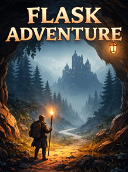

# Flask Adventure

A browser-based text adventure game built with Flask. Started as a simple experiment and evolved into a structured, session-driven adventure engine — built from the ground up, not copied from tutorials.

---

## Project Goals

- Learn Flask deeply through real building
- Create a modular, extensible text-adventure engine
- Manage game state cleanly on the server
- Build a foundation that can evolve into a reusable engine template

---

## What Has Been Built

### Core Engine Architecture

The game is split into focused modules:

| File | Purpose |
|------|---------|
| `controller.py` | Orchestrates all game systems |
| `parser.py` | Parses raw text commands into structured input |
| `actions.py` | Executes player actions (move, pick up, drop, use, look) |
| `event_manager.py` | Manages event checking and firing |
| `event_types.py` | Event class definitions — each event type knows how to check itself |
| `persistence.py` | Save and load game state to/from database |
| `gameObjects.py` | Map, Room, Item classes and YAML loading |
| `player.py` | Player state and movement logic |

### Game Objects

- `Item` — name, states (description + use text per state), current state
- `Room` — name, states (description per state), exits, inventory, exit destinations
- `Map` — floors, rooms, events, loaded from `game_data.yaml`

Rooms and items support a state system — descriptions and use text change dynamically as the player progresses through the game.

### Command System

Commands are parsed from plain English input:

```
go south / south
get knife / pickup knife
drop knife
look knife
use axe with door
help
```

The parser converts input into a structured command dict which the action handler executes. Supports direction synonyms, multiple pickup words, and `use [item] with [target]` syntax.

### Event System

Events are defined in `game_data.yaml` and fire based on game conditions:

- `all_rooms_visited` — triggers when required rooms have been visited
- `item_used_with` — triggers when a specific item is used on a specific target in a specific room

Events can:
- Unlock exits between rooms
- Add items to rooms
- Remove items from player inventory
- Change room states
- Change item states
- Display messages to the player

#### Event Architecture

All event logic lives in a proper class hierarchy:

**`event_types.py`** defines a base `Event` class and one class per event type:

```python
class Event:                # base class, all events inherit from this
class AllRoomsVisitedEvent  # fires when a set of rooms have all been visited
class ItemUsedWithEvent     # fires when item + target + room all match
```

Each event class holds its own parameters and knows how to check itself via a `check()` method. Adding a new event type means adding a new class — nothing else changes.

**`gameObjects.py`** builds event objects from YAML via `make_event()` when the map loads.

**`event_manager.py`** checks events by type and fires them via a shared `_fire_event()` method that handles all result types consistently.

#### Event Result Types

Events in `game_data.yaml` support the following result keys:

| Key | What it does |
|-----|-------------|
| `open_exit` | Unlocks a directional exit on a room |
| `add_item` | Spawns an item into a room |
| `remove_item` | Removes an item from the player's inventory |
| `set_state` | Changes a room to a new state |
| `set_item_state` | Changes an item to a new state |
| `message` | Displays a message to the player |

### State System

Rooms and items are no longer static — they have states that change as the player interacts with the world.

**Room states** — each room has a `default` state and optional additional states:

```yaml
vault:
  states:
    default: "A locked iron box sits apart, humming..."
    changed: "The box hangs open. The humming has stopped."
```

**Item states** — each item has a `default` state and optional additional states with both description and use text:

```yaml
lantern:
  states:
    default:
      description: "A dusty oil lantern. It still has oil in it."
      use: "You hold the lantern up. Shadows retreat from its warm glow."
    changed:
      description: "A lit oil lantern. It burns with a steady warm flame."
      use: "The lantern is already lit. It burns steadily."
```

Events set states when they fire, so the world reacts to what the player has done. State is persisted between sessions.

### Action / Response Separation

`use [item] with [target]` events return a tuple of `(cmd_response, event_message)`. This means event messages and regular command responses are cleanly separated before reaching the template:

- `CMD_RESPONSE` — direct feedback from the action ("You picked up the lantern")
- `EVENT_MESSAGES` — story/puzzle events triggered by the action ("The wall opens...")

### Save / Load System

Full game state is persisted to SQLite via Flask-SQLAlchemy:

- Player position and floor
- Player inventory and item states
- Room inventories and room states
- Visited rooms and completed events
- Unlocked exits and exit destinations

Items and rooms are always rebuilt from YAML recipes on load, with saved state restored on top. This means recipe changes are always picked up cleanly.

Each player ID gets its own controller instance so multiple players can run simultaneously.

### Map System

The map is defined entirely in `game_data.yaml` — no hardcoded room data in Python. Items, rooms, events, states, and use responses are all data-driven. Adding a new room or item requires only editing the YAML file.

- Floor layout defined via `floors` array — fully dynamic
- Supports multiple floors with stair and teleport connections between them
- All exit connections defined in events — rooms start locked and open through gameplay
- Teleport exits using cardinal directions show ✦ on the mini map
- Stair exits using up/down show ⬆⬇ on the mini map
- Interactable targets highlighted in room descriptions via `<em>` tags

### UI Features

- Dark dungeon-themed CSS with medieval fonts and gold accents
- Frosted glass UI panels over atmospheric background image
- Mini map showing explored rooms, current position, and floor-aware tracking
- Floor indicator displayed alongside the mini map
- Mobile responsive layout
- Event messages displayed separately from command responses
- Interactable targets highlighted in gold in room descriptions

---

## Tech Stack

- Python 3
- Flask + Flask-SQLAlchemy
- SQLite
- PyYAML
- Jinja2 Templates
- HTML5 / CSS3 (no frontend framework)

---

## Folder Structure

```
flask_adventure/
│
├── static/
│   ├── css/
│   │   └── main.css
│   └── images/
│
├── templates/
│   ├── base.html
│   ├── index.html
│   ├── game.html
│   └── macros.html
│
├── data/
│   └── game_data.yaml
│
├── game/
│   ├── __init__.py
│   ├── controller.py
│   ├── parser.py
│   ├── actions.py
│   ├── event_manager.py
│   ├── event_types.py
│   ├── persistence.py
│   ├── gameObjects.py
│   └── player.py
│
├── instance/
│   └── test.db
│
├── app.py
├── Procfile
└── requirements.txt
```

---

## How to Run

```bash
git clone https://github.com/garysgray/Flask_ADVENTURE.git
cd Flask_ADVENTURE
pip install -r requirements.txt
python app.py
```

Open in browser: `http://127.0.0.1:5000`

---

## Planned Improvements

- **Win conditions** — define a win state in YAML, game detects and responds when all required events are completed
- **Journal system** — player journal object that logs all triggered events, supports `look journal` command, and gives meaningful "you already did that" responses instead of silent skips
- **Item keywords** — items get aliases so `light lantern with matches` works the same as `use matches with lantern`, making commands feel more natural
- Login system with admin and player accounts
- Room images displayed per room
- NPC interactions
- Room builder tool integration with live game data
- Turn this into a clean, shareable Flask adventure engine template

---

## License

MIT

---

Built by Gary Gray.
