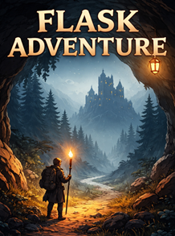

# Flask Adventure

A browser-based text adventure game engine built with Flask and Python. Started as a simple experiment and evolved into a structured, data-driven, session-persistent adventure engine — built from the ground up with modular architecture, natural language parsing, dynamic fixture states, and an action-unlocking progression system.

---

## Project Goals

- Learn Flask and modern Python architecture deeply through real building
- Create a modular, extensible text-adventure engine driven by declarative YAML adventure files
- Manage game state cleanly on the server with user authentication and multiple save slots
- Support rich natural language input (locative prepositions, verb-unlocking, multi-word aliases)
- Build a foundation that can evolve into a reusable engine template for any genre

---

## What Has Been Built

### Core Engine Architecture

The game is split into focused, single-responsibility modules:

| File | Purpose |
|------|---------|
| `controller.py` | Orchestrates all game systems, player commands, and turn cycles |
| `loader.py` | Loads, normalizes, and validates YAML adventure files and exit integrity |
| `parser.py` | Parses raw text into structured commands with entity resolution & preposition support |
| `actions.py` | Executes player actions with action-gating, movement, items, and fixtures |
| `event_manager.py` | Manages event checking, conditions, and firing results |
| `event_types.py` | Base and typed event classes with condition checks |
| `persistence.py` | Saves and loads complete game sessions to and from SQLite database |
| `gameObjects.py` | Map, Room, Fixture, and Item classes with state handling |
| `player.py` | Player state, inventory, visited rooms, and unlocked actions tracking |

---

### Data-Driven Adventure Architecture

Adventures are completely decoupled from Python code and defined in modular YAML files in `/data/` (configured via `config.py`):

- **Modular Adventures**: Run fantasy quests (`delictum.yaml`), modern skate adventures (`skate_adventure.yaml`), sci-fi Jedi trials (`lightsaber_training.yaml`), or custom scenarios.
- **`loader.py` Validation**: Automatically validates adventure schema, checks coordinate layouts, ensures all exits connect to valid rooms, and catches syntax issues at startup.

---

### Room & Fixture System

Rooms are no longer monolithic static text blocks. The engine dynamically composes room descriptions:

1. **`base_description`**: Atmospheric foundation text for the room.
2. **`fixtures`**: Interactive scene setpieces (e.g. pedestals, terminals, rails, droids) with independent states, priorities, and custom examination text:
   ```yaml
   fixtures:
     training_dummy:
       priority: 10
       state: default
       states:
         default: "A carbonite practice dummy stands bolted to the floor."
         slashed: "The practice dummy bears a glowing molten seam across its chest."
       examine:
         default: "A sturdy mechanical sparring dummy designed for blade fundamentals."
         slashed: "The dummy's armor hums with dissipating thermal energy."
   ```
3. **Room Inventory**: Items currently on the floor rendered cleanly.
4. **`trailing_description`**: Exit pathways and environmental transitions.

---

### Command System & Natural Language Parser

The parser translates natural English sentences into structured commands:

```
south / go south
examine dummy / look at dummy
strike dummy / strike over dummy
do kickflip over gap
deflect over droid
open chest with brass_key
drop locket into well
activate holocron
read journal
help
```

Key parser capabilities:
- **Locative Prepositions**: Full parsing support for `over`, `across`, `under`, `through`, `around`, `along`, `from`, `off`, `with`, `into`, and `onto`.
- **Filler Word Stripping**: Strips leading verbs and auxiliary fluff (e.g., `do kickflip over gap` resolves to verb `kickflip` on target `gap`).
- **Entity Vocabulary Resolution**: Canonical IDs, display names, and `aliases` (including multi-word phrases like `"marksman droid"`) resolve seamlessly.
- **Direction Synonyms**: Standard directions and abbreviations (`n`, `s`, `e`, `w`, `up`, `down`).
- **Contextual Already-Done Handling**: Attempting a completed puzzle event gives narrative feedback rather than a generic failure.

---

### Custom Verbs & Action-Unlocking System

Adventure authors can introduce genre-specific verbs and gate them behind gameplay progression:

1. **Custom Action Declaration (`custom_verbs`)**:
   ```yaml
   custom_verbs:
     single_object: [strike, parry, deflect, thrust, ollie, kickflip, grind]
     two_object: [use, strike, parry]
   ```

2. **Initial Action Gating (`player.unlocked_actions`)**:
   Player starts with basic moves unlocked (`strike`, `parry`, `ollie`, `examine`).

3. **Contextual Locked Messages (`player.locked_messages`)**:
   When a player attempts a locked maneuver before learning it, the engine provides tailored narrative hints instead of generic failures:
   ```yaml
   locked_messages:
     deflect: "You haven't mastered blaster deflection yet! Study the holocron in the Archives."
     kickflip: "You haven't learned how to kickflip yet! Ask Coach at the skate shop."
   ```

4. **Dynamic Unlocking via Events (`unlock_action`)**:
   Solving puzzles or training with NPCs unlocks new actions dynamically:
   ```yaml
   result:
     unlock_action: deflect
     message: "[ NEW COMBAT ACTION UNLOCKED: DEFLECT ]"
   ```

---

### Event System

Events drive game logic, story progression, and puzzles without writing Python code:

- **Triggers**: `solo` (action on target) or `two_object` (item used with/on target).
- **Conditions**: `in_room`, `events_completed`, `item_in_inventory`, `item_in_room`, `all_rooms_visited`.
- **Event Results**:
  | Key | Description |
  |-----|-------------|
  | `unlock_action` / `unlock_actions` | Grants the player new custom actions/verbs |
  | `set_fixture_state` | Updates fixture visual and examination state |
  | `open_exit` / `set_exit` | Unlocks directional exits between rooms |
  | `add_item` | Spawns an item into a room or inventory |
  | `remove_item` | Removes an item from player inventory |
  | `journal` | Logs room-specific narrative entries into the player's journal |
  | `message` | Displays formatted story text to the player |

---

### Win Conditions & Win Screen

- **Win Conditions**: Defined in YAML as a checklist of event IDs (`win_conditions`) that must all be completed.
- **Win Screen**: When the final win condition is met, the engine transitions to a dedicated victory display featuring the adventure's `win_screen` narrative, final stats, and a play-again option while preserving journal access.

---

### Journal & Intro System

- **Persistent Journal**: Records all major discoveries and event narratives as they happen, viewable at any time via `read journal` or the UI button.
- **Intro Modal**: Story backstory and command instructions display in an elegant entrance modal on first visit and persist permanently in the journal.

---

### Save / Load & User Session Persistence

Full game state is saved securely in SQLite via Flask-SQLAlchemy:

- **User Accounts**: Automatic user onboarding and private save slots.
- **Hashed Passwords**: Passwords secured via `werkzeug.security`.
- **Full State Rehydration**: Player position, inventory items, fixture states, completed events, unlocked actions, visited rooms, and journal history are restored cleanly on top of YAML recipes.

---

### Authoring & Developer Tools

- **YAML Editor Suite (`yaml_editor/`)**: Built-in web editor and schema inspection tool to view map layouts, validate rooms and fixtures, edit event chains, and export clean adventure files.

---

## Tech Stack

- **Backend**: Python 3, Flask, Flask-SQLAlchemy, SQLite, PyYAML, Werkzeug
- **Frontend**: Jinja2 Templates, HTML5, CSS3, JavaScript (Vanilla, no bulky frameworks)
- **Tooling**: Comprehensive unit test suite (`unittest`), schema validator (`loader.py`), and interactive YAML editor

---

## Folder Structure

```
flask_adventure/
│
├── static/
│   ├── js/
│   │   └── journal.js
│   ├── css/
│   │   └── main.css
│   └── images/
│
├── templates/
│   ├── base.html
│   ├── login.html
│   ├── index.html
│   ├── game.html
│   └── macros.html
│
├── data/
│   ├── delictum.yaml              # Original dark mystery adventure
│   ├── skate_adventure.yaml       # Action-unlocking skateboarding adventure
│   ├── lightsaber_training.yaml   # Jedi trials combat training adventure
│   └── yaml_tutorial_guide.yaml   # Authoring guide & recipe reference
│
├── game/
│   ├── __init__.py
│   ├── controller.py              # Main loop & command coordinator
│   ├── loader.py                  # YAML loading & validation engine
│   ├── parser.py                  # Natural language command parser
│   ├── actions.py                 # Action execution & verb gatekeeper
│   ├── event_manager.py           # Event checking & execution
│   ├── event_types.py             # Event definitions & conditions
│   ├── persistence.py             # Save/load database manager
│   ├── gameObjects.py             # Map, Room, Fixture, and Item models
│   └── player.py                  # Player state & unlocked actions
│
├── yaml_editor/                   # Standalone browser-based adventure editor
│   ├── index.html
│   ├── js/
│   ├── css/
│   └── yamlEditorHints.md
│
├── tests/                         # Automated unit test suite
├── app.py                         # Flask server entry point
├── config.py                      # Active adventure & database settings
└── requirements.txt
```

---

## How to Run

1. **Clone the repository**:
   ```bash
   git clone https://github.com/garysgray/Flask_ADVENTURE.git
   cd Flask_ADVENTURE
   ```

2. **Install dependencies**:
   ```bash
   pip install -r requirements.txt
   ```

3. **Start the application**:
   ```bash
   python app.py
   ```

4. **Play in your browser**:
   Open `http://127.0.0.1:5000` (or port configured in `app.py`). Create an account on your first visit to start an adventure.

---

## Running Automated Tests

Run the full test suite using Python's built-in test runner:

```bash
python3 -m unittest discover -s tests -p "test_*.py"
```

---

## Future Roadmap

- **Room Illustration Artwork**: Optional image asset field per room/state in YAML to display scene art in the header panel.
- **Branching NPC Dialogue Trees**: Multi-choice conversation states using the existing event class pattern.
- **Audio Effect Triggers**: Ambient audio tracks and sound effect cues triggered on specific event completions.
- **Command History Recall**: Up/down arrow key recall in the command input box.
- **Cloud Deployment Profiles**: Pre-configured deployment scripts for containerized hosting.

---

## License

MIT License. Built with passion by Gary Fn Gray.
